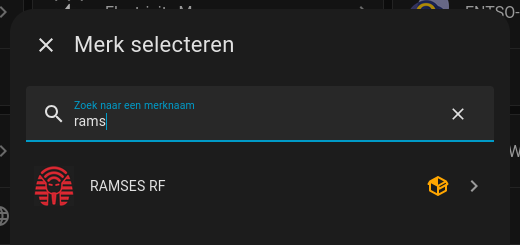
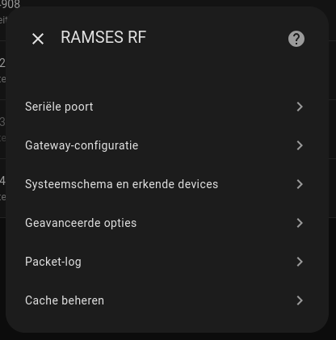
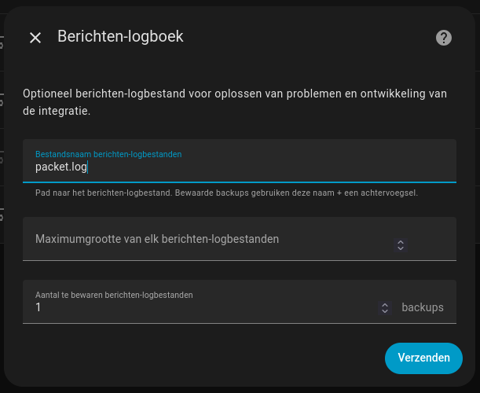
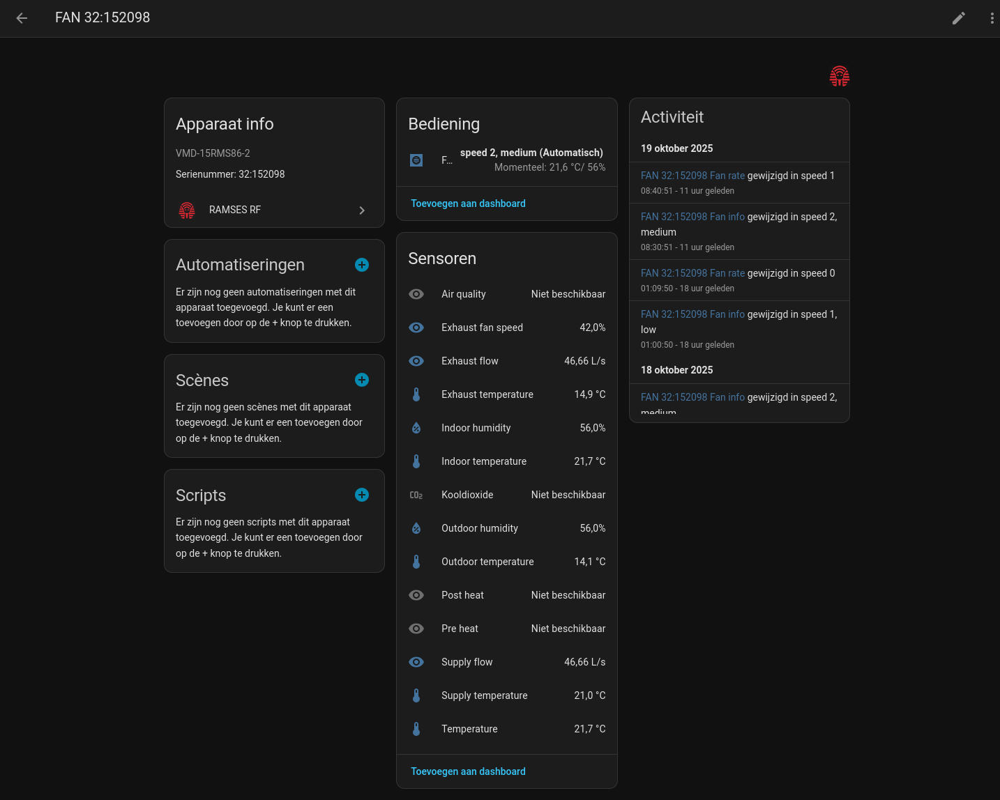
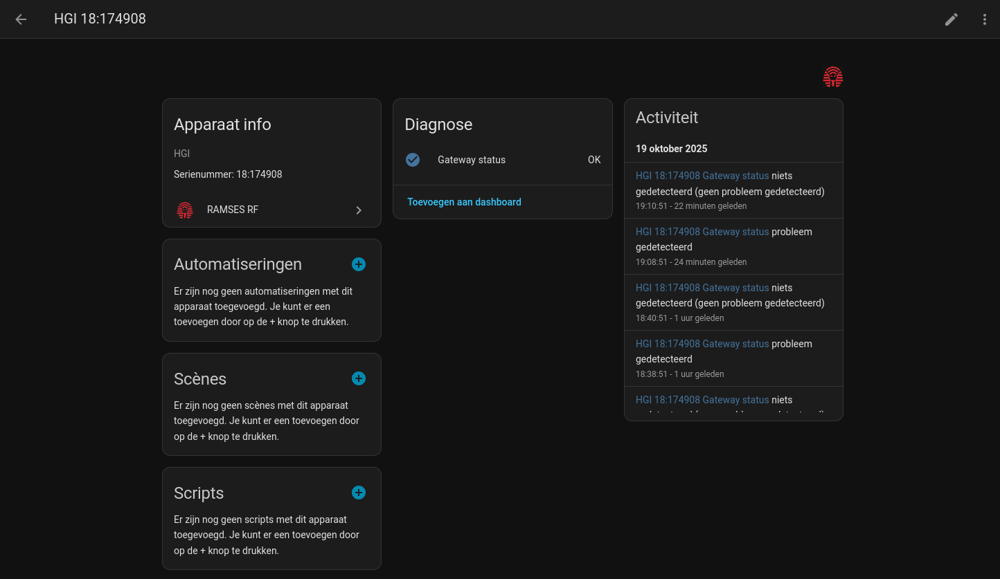
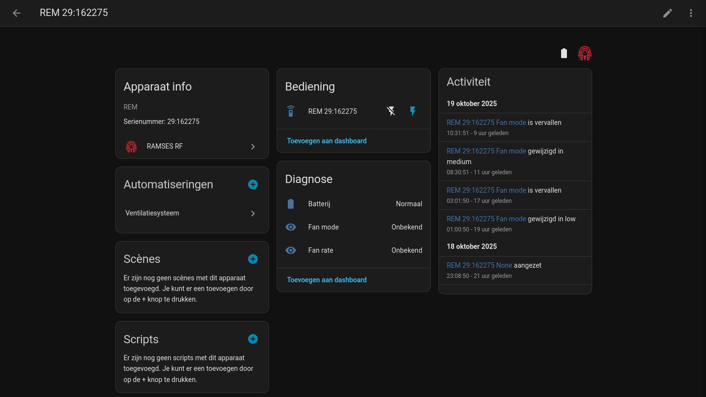


**Info:** This tutorial should work for the HRC 350 as well!


## What you need.
To be able to follow this tutorial you will need a couple of things in order to make this work. As of the moment of writing this seems the most convenient way to set this up. This tutorial will not be adapted with more recent technologies developed by the community.

* A working [Home Assistant](https://www.home-assistant.io/) installation
* The [HACS add-on](https://hacs.xyz/) installed in Home Assistant.
* The Ramses USB device from [Indalotech](https://indalo-tech.onlineweb.shop/product/ramses-esp). 
* Spare time and the will to invest it.


## Installation of the components

First, we will do the installation of the [Ramses CC integration](https://github.com/ramses-rf/ramses_cc). This is a necessary step to enable the communication between Home Assistant and the Orcon ventilation unit. 


**Warning:** Make sure that the Indalotech USB dongle is connected to the Home Assistant instance via USB.


### Add the integration to HACS as a custom repository.  
To do this, [follow the steps](https://github.com/ramses-rf/ramses_cc/wiki/1.-Installation#add-ramses_cc-as-a-custom-repository-to-hacs) that you can find in the Ramses RF wiki.

### Install the integration via HACS.  
Just like in the previous bulletpoint, there are [some easy steps](https://github.com/ramses-rf/ramses_cc/wiki/1.-Installation#add-ramses-rf-as-an-integration-via-hacs) to follow on the Ramses RF wiki as well.

### Enable the integration in Home Assistant.  
Go to *Settings / Integrations* and in the lower right corner, press the **Add Integration** button. In the window that pops up search for ramses. You will then find the Ramses RF integration as shown below. Install it.  

Afterwards a **reboot** will be required.



## Configuring the Ramses RF integration

Some settings need to be done to enable discovering your devices and messages. In Home Assistant go to *Settings / Integrations / Ramses RF* and press the cogwheel to open te settings dialog. You will see a pop-up window with all the possible settings like shown below. 



### Setting the serial port to be used by Ramses RF.  
Depending on your situation the device will be named different. Sometimes selecting the connected device in the workflow will not work. You can select the last option to enter the path manually.   

In my case, the path is:  

```
/dev/serial/by-id/usb-Espressif_USB_JTAG_serial_debug_unit_CC:BA:97:0A:AB:3C-if00 
```  


**Important** It is advised to use the /dev/serial/by-id path as this never changes thus making the integration work perfectly in the long run.


Press **Next** and skip the advanced configuration, we don't need it.

### Setting the gateway configuration  
In the gateway configuration option, just set the scan interval to 60 seconds and save your configuration.

### Setting the packet log option.  
This option allow Home Assistant to log all the messages Ramses RF intercepts between your devices. Possibly also the ones from your neighbours but that's some thing you will need to discover. Over here, the neighbours have the same ventilation unit and I do not see them in my traffic.  

Do the following settings:
* Name the file packet.log
* Keep 1 backup



From now on, packets will be logged for you analyze.

### Configuring the system scheme and known devices  
This is the most important step in the whole configuration process. With this configuration you tell Home Assistant how to interpret all the different messages that are broadcasted in the system.  

Some devices will be autodiscovered by the system and will be visible in the devices under the Ramses RF integration. Note down these id's. ID's are written under the form of xx:xxxxxx. These id's represent the devices that are available to control.  

Next  to these id's we will make an id up ourselves to behave as the fake remote. This fake remote will be Home Assistant and we will need to register it in the ventilation unit later down the line. For easy reference you can use the same id as I did. Just make sure that the id doesn't already exist in your discovered devices.  

**Fake remote id:** 29:162275  

To start, browse to *Integrations / Ramses RF / Settings* and open the dialog to save your **system scheme** and **known devices**.  

In the dialog window are 2 fields available. In the textfield for system scheme you have to note down all the devices that are available in the system.  


**Important** This **includes** the fake remote as well.


Write the devices using the following YAML syntax:  

``` yaml
orphans_hvac:
  - "18:174908"
  - "29:162275"
  - "32:154019"
  - "32:152098"
```
This tells Home Assistant which devices are present and can be used inside your smart home. This will create the necessary entities but at this point we have to tell Home Assistant which deviceclass to link them to in order to use them properly.  

I will give you the YAML code I have used and it should work when you are using the Orcon Ventiflow HRC ventilation units. The only thing you have to do is analyse which device does what.  


**Important** You can get very detailed information about this from chatGPT. Copy your packet.log file in it and it should be able to tell you which device is your remote and which one is the fan, etc...


When everything is identified, adapt the YAML code below with the correct id's.

```yaml
"18:174908":
  class: HGI
"29:162275":
  _note: Orcon 15RF
  class: REM
  commands:
    auto: " I --- 29:162275 32:152098 --:------ 22F1 003 000407"
    auto2: " I --- 29:162275 32:152098 --:------ 22F1 003 000507"
    away: " I --- 29:162275 32:152098 --:------ 22F1 003 000007"
    boost: " I --- 29:162275 32:152098 --:------ 22F1 003 000607"
    bypass_auto: " W --- 29:162275 32:152098 --:------ 22F7 003 00FFEF"
    bypass_close: " W --- 29:162275 32:152098 --:------ 22F7 003 0000EF"
    bypass_open: " W --- 29:162275 32:152098 --:------ 22F7 003 00C8EF"
    disable: " I --- 29:162275 32:152098 --:------ 22F1 003 000707"
    high: " I --- 29:162275 32:152098 --:------ 22F1 003 000307"
    high_15: " I --- 29:162275 32:152098 --:------ 22F3 007 00120F03040404"
    high_30: " I --- 29:162275 32:152098 --:------ 22F3 007 00121E03040404"
    high_60: " I --- 29:162275 32:152098 --:------ 22F3 007 00123C03040404"
    low: " I --- 29:162275 32:152098 --:------ 22F1 003 000107"
    med_60: " I --- 29:162275 32:152098 --:------ 22F3 007 00123C02040404"
    medium: " I --- 29:162275 32:152098 --:------ 22F1 003 000207"
    request10D0: RQ --- 18:203011 32:152098 --:------ 10D0 001 00
    request31DA: RQ --- 29:162275 32:152098 --:------ 31DA 001 00
    reset_filter: " W --- 29:162275 32:152098 --:------ 10D0 002 00FF"
  faked: true
"32:152098":
  class: FAN
"32:154019":
  class: REM
```
**Clarification:**  
In my system the mapping is:  

* **18:174908**: Home Assistant using the Indalotech USB device.
* **29:162275**: The fake remote Home Assistant uses to send commands. This is virtual!
* **32:152098**: The ventilation unit.
* **32:154019**: My physical remote that comes with the ventilation unit.

When you have added the necessary information in both fields, **enable the checkbox** to accept only messages from known device id's to keep your log clean. Save it as well!  

#### Does it all work now?
At this point you should be able to read the values from the ventilation unit. After a reboor it takes a couple of minutes, no more the 5 before any readings will be displayed.  

Let's take a look at **FAN 32:152098**  



This is a confirmation that the configuration for this device id is correct. The available readings are displayed so you can continue to the next device.  

Now, we will look at the device **HGI 18:174908**  



From time to time, the status can go to problem status but I haven't encountered a real problem with this. It looks like it takes the problem status when you open the settings from the integration and afterwards it returns to an OK state.  

Lets take a look at the remotes **REM 29:162275** and **REM 32:154019**  

I will show only 1 screenshot as this is the same for both devices. Just like with the gateway, there is not much to see. 



## Registering the fake remote in your ventilation unit
Before you are able to send commands from Home Assistant, your fake remote needs to be paired wtih the ventilation unit.  
This involves the following steps:  

* Shut down the ventilation unit.
* Start the ventilation unit to enable the pairing mode.
* Pair the remote by sending the correct message to the ventilation unit.

When you start the ventilation unit, you are able to bind new devices to the ventilation unit during the first 5 minutes. To bind a device you use the developer tools / actions screen.  
Use the ramses_cc.bind_device action or use the yaml code below.  

``` yaml
service: ramses_cc.bind_device
data:
  device_id: 29:162275
  offer:
    "22F1":
    "22F3":
    "10E0":
  device_info: " I --- 29:162275 63:262142 --:------ 10E0 038 000001C894030167FFFFFFFFFFFF1B0807E4564D492D313557534A3533000000000000000000"
  ```

Check your packet.log for the messages with 1FC9 in them. You should see your message which is replied to by the ventilation unit. IF you see the ventilation unit reply it means that your fake remote is successsfully paired with the unit. Hooray!

## Sending commands using the fake remote
This is all done by the **remote.send_command** action. The available commands are defined in your known devices configuration. You can use the names and don't have to remember the payload, this is already defined.  

The following yaml shows an action to set the fan speed to high.  
``` yaml
action: remote.send_command
data:
    command: high
    entity_id: remote.29_162275
```

When you test this in the developer tools you should hear your ventilation unit respond.

## Conclusion
Setting this up isn't as conveniet as many other integrations as the situation is different with every installation. My installatin is very small but yours can be different. I have written this post because there are a lot of people with questions about this one. So, it is doable to configure this. Keep your head clear and take your time. ChatGPT can be a huge help to analyze your packet.log file, use it.  

My blogpost is based on this [dutch forumpost on Tweakers](https://gathering.tweakers.net/forum/list_messages/2256242), so I would like to thank the different participants in the thread. Their info was helpful and helped me figuring this out. Thanks a lot guys!

## How is this integrated in my smart home?

Currently, I have one automation with multiple triggers to create the following ventilatin scheme:  

* Nobody is home: away mode
* Night time & occupied: fan speed 1
* Daytime & occupied: fan speed 2
* Kooking mode: fan speed 3 (returns to fan speed 2, 30 minutes after we stopped cooking)
* Shower mode: same as cooking mode but this is not currently implemented, I still haven't got a reliable way to detect someone is showering or taking a bath.

Thanks for reading!

J.